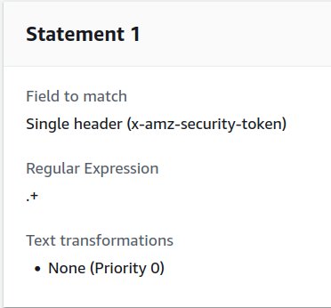

# Personal Task Manager as a Telegram Bot Powered by ChatGPT

This is a simple task manager Telegram bot that helps you manage your tasks within Telegram chats. It saves, formats, and retrieves your tasks with the help of ChatGPT. ChatGPT does not store any information; it only processes user messages and retrieves task information from DynamoDB.

## Project Stack

- Python
- DynamoDB
- AWS Lambda
- AWS API Gateway
- AWS WAF
- AWS S3
- AWS SAM CLI

This project is deployed on AWS using the AWS SAM CLI tool. Both the REST API endpoints and the Telegram bot are deployed as Lambda functions to optimize costs, while user tasks are stored in DynamoDB.

## Pre-requisites

- Access to AWS account
- AWS command line credentials with write access for Lambda, API Gateway, DynamoDB, WAF and S3
- AWS CLI installed and configured with credentials above
- AWS SAM CLI installed
- Telegram bot registered with BotFather
- Telegram bot token
- ChatGPT API key

## How to Deploy

The deployment process consists of two parts:
- Deploying REST API endpoints
- Deploying the Telegram bot
- Enable webhooks for bot in Telegram

### Deploying REST API Endpoints

1. Navigate to the `app-endpoints/` directory.
2. Build the code:
   ```bash
   sam build
   ```
3. Deploy the code:
   ```bash
   sam deploy --guided
   ```
4. In the AWS Console, verify that the API Gateway and Lambda functions have been created.

### Deploying the Telegram Bot

1. Navigate to the `telegram-bot/` directory.
2. Build the code:
   ```bash
   sam build
   ```
3. Retrieve the following details:
   - Your Telegram bot token.
   - Your ChatGPT token.
   - IDs of authorized users who can use your bot separated by comma (`1234567890,0987654321`).
   - The URL of the API Gateway endpoint. You can find this URL in the AWS Console under **API Gateway > Your API > Stages > Your Stage > Invoke URL**.
4. Deploy the code:
   ```bash
   sam deploy --guided \
     --parameter-overrides \
     "ParameterKey=TelegramBotToken,ParameterValue=your-telegram-token-here ParameterKey=AuthorizedUsers,ParameterValue=id-of-telegram-authorised-users ParameterKey=OpenAiApiKey,ParameterValue=your-chatgpt-token-here ParameterKey=GPTModel,ParameterValue=gpt-4 ParameterKey=GPTSystemPrompt,ParameterValue='You are a helpful assistant that helps users manage their tasks.' ParameterKey=TaskManagerAPIGatewayURL,ParameterValue='url-of-api-gateway-endpoint'"
   ```
   **Note:** Replace the placeholder values (e.g., `your-telegram-token-here`, `id-of-telegram-authorised-users`, etc.) with your actual credentials and parameters.
5. In the AWS Console, verify that the Lambda function and API Gateway for the Telegram bot have been created.

# Register bot as Telegram webhook

1. Get the URL of the API Gateway endpoint for the Telegram bot.
```
API Gateway > Your API > Stages > Your Stage > Invoke URL
```

2. And use following command in the terminal:
```bash
curl -X POST "https://api.telegram.org/bot<BOT_TOKEN>/setWebhook" -d "url=<WEBHOOK_URL>"
```

Below is a revised version of your documentation with improved clarity, consistency, and minor typo fixes:

## Security

To protect the API Gateway endpoints, we will use a combination of API Gateway resource policies and AWS WAF rules.

### 1. Add Resource Policy to the API Gateway

To allow requests only from the Telegram bot's Lambda function, add a resource policy to the Task Manager API Gateway:

1. In the AWS Console, navigate to **API Gateway > Task Manager API Gateway > Resource Policy**.
2. Add the following policy:
   ```json
   {
     "Version": "2012-10-17",
     "Statement": [
       {
         "Effect": "Allow",
         "Principal": {
           "AWS": "your-telegram-bot-role-arn"
         },
         "Action": "*",
         "Resource": "arn:aws:execute-api:YOUR-AWS-REGION:YOUR-AWS-ACC-NUM:TASK-MANAGER-API-GATEWAY-ID/*/*/*"
       }
     ]
   }
   ```
3. Replace the following variables with the actual values:
   - **`your-telegram-bot-role-arn`**: The ARN of the Telegram bot's Lambda function role. You can find it under **Lambda > TelegramBotFunction > Configuration > Permissions > Role name > ARN**.
   - **`YOUR-AWS-REGION`**: The AWS region where the API Gateway is deployed.
   - **`YOUR-AWS-ACC-NUM`**: Your AWS account number.
   - **`TASK-MANAGER-API-GATEWAY-ID`**: The API Gateway ID for the Task Manager API. You can find it under **API Gateway > Task Manager API Gateway > API Settings > API ID**.

### 2. Enable AWS_IAM Authorization for the API Gateway

Since our Telegram bot signs its requests using the AWS SigV4 package, you can enable `AWS_IAM` authorization to verify these requests:

1. In the AWS Console, navigate to **API Gateway > Task Manager API Gateway > Resources**.
2. Select the HTTP method (e.g., GET, POST) you want to secure.
3. Under **Method Request**, click **Edit**.
4. Set **Authorization** to `AWS_IAM`.

### 3. Create AWS WAF Rules to Protect API Gateway Endpoints

To further secure your API Gateway endpoints, create AWS WAF rules that filter out requests lacking the proper authorization headers:

1. In the AWS Console, navigate to **AWS WAF > Web ACLs**.
2. Create a new Web ACL in the same region as your API Gateway.
3. Associate the Task Manager API Gateway with this Web ACL.
4. Add rules with conditions to allow only requests that include the `x-amz-security-token` header. For example, create a rule that:
   - Checks for the presence of the `x-amz-security-token` header.
   - Allows requests only when this header is included.

   Below is an example of how such a rule might look:
   
   
6. Set default web ACL action to `Block` for requests that don't match any rules.
